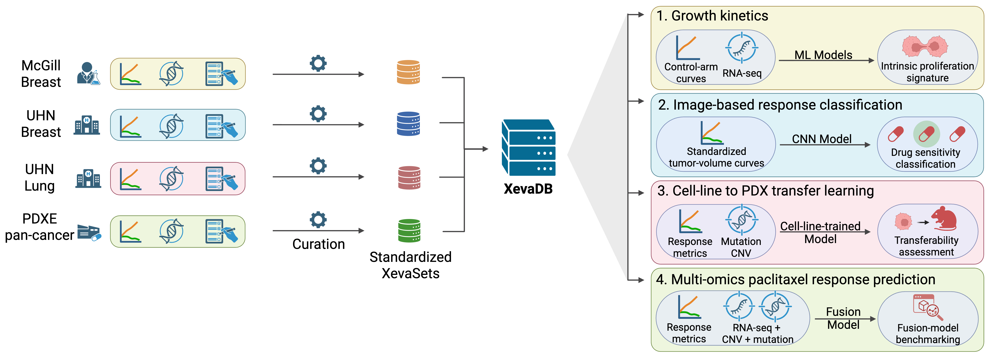

# XevaDB_case_study

## Overview
Reproducible pipeline for four PDX pharmacogenomic case studies built on
**XevaDB**, a standardized resource integrating four PDX cohorts (McGill
breast, UHN breast, UHN lung, PDXE pan-cancer):
1. growth-kinetics modeling,
2. image-based drug-response classification,
3. cell-line-to-PDX transfer learning, and
4. multi-omics paclitaxel response prediction.



This repository accompanies the manuscript **"XevaDB enables AI-driven
longitudinal pharmacogenomic modeling in patient-derived xenografts"**
(citation and DOI to be added upon publication).

The repository reproduces all analyses, intermediate results, figures, supplementary figures, and supplementary tables reported in the manuscript.

## Citation

If you use this code or XevaDB, please cite:

> Feng G., Boccalon M., Tran M.C.A., et al., "XevaDB enables AI-driven longitudinal pharmacogenomic
> modeling in patient-derived xenografts," (under review)

A versioned snapshot of this repository will be archived on Zenodo upon
acceptance (DOI: pending).

## Repository layout

```
rawdata/                Raw, unmodified source XevaSets + external data — see rawdata/README.md
procdata/               Flat per-cohort tables extracted from rawdata/   — see procdata/README.md
0_xevaset_extraction/   Extraction scripts: rawdata/ -> procdata/, + Figure 1
1_doublingRate/         Case study 1: growth-kinetics modeling         (Figure 2, Supp Fig 1)
2_drugSensitivity/      Case study 2: image-based response classification (Figure 3, Supp Fig 2)
3_carboplatin/          Case study 3: cross-platform NeST-VNN validation   (Figure 4, Supp Fig 3)
4_paclitaxel/           Case study 4: multi-omics paclitaxel prediction    (Figure 5, Supp Fig 4)
results/                Per-case intermediate/final pipeline outputs    — see results/README.md
figures_tables/         Manuscript figures/tables (submission masters) — see figures_tables/README.md
pretrained_models/      Pretrained NeST-VNN ensemble (external, used by case study 3)
```

Each of `1_doublingRate/`, `2_drugSensitivity/`, `3_carboplatin/`, and `4_paclitaxel/` has its own README with the
exact notebook run order and figure/table mapping.

## System requirements

- **OS**: developed and tested on macOS (Darwin). No GPU required to run the pipeline.
- `R` (v4.4.2), `Xeva` (v1.22.1), `limma` (v3.62.2), `dplyr`(v1.1.4), `ggplot2`(v4.0.1).
- **Python**: 3.9.6, two separate environments (see below).
- **Expected runtime**:
    -  most notebooks complete in a few minutes.
    -  The slowest steps are `2_drugSensitivity/3-ml_resnet18.ipynb` and `4_paclitaxel/2-ML.ipynb`'s repeated cross-validation with nested grid search and stacking.
        - up to ~30 minutes on a standard workstation.
  
## Environment setup

Two separate environments are required:

- **`requirements.txt`** — everything except the ResNet18 notebook.
- **`requirements-resnet.txt`** — ResNet18 notebook (`2_drugSensitivity/3-ml_resnet18.ipynb`)
- **pretrained model** `3_carboplatin/4-nestvnn_modeling.ipynb` additionally needs the pretrained [NeST-VNN](https://github.com/idekerlab/nest_vnn) ensemble's own virtual env — see `pretrained_models/nest_vnn/read_me_to_run.txt`.

## Reproducibility
The repository contains:

- raw input datasets and download instructions
- processed datasets
- intermediate results
- trained models
- manuscript figures
- supplementary figures
- supplementary tables
  
Running the workflows in the order described below reproduces all manuscript results.

## Reproduction order

1. **Download Public Datasets**
   - Download the required public datasets and reference files. See `rawdata/README.md`.
2. **Data Extraction**
   - Essential step to extract flat table and generate images from the downloaded **XevaSet** objects
   - `rawdata/`(input) -- `0_xevaset_extraction/`(code) --> `procdata/`(output)
3. **Run Each Case Study**
   - Four case studies:
     - `1_doublingRate/`
     - `2_drugSensitivity/`
     - `3_carboplatin/`
     - `4_paclitaxel/`
   - The four case studies are independent and may be run in any order.
   - Within each case study, follow that folder's own README for notebook order.

## Case study summary

| # | Folder | Question | Primary model |
|---|---|---|---|
| 1 | `1_doublingRate/` | Does RNA-seq predict intrinsic PDX growth rate? | ElasticNet / Random Forest / Lassoed Forest |
| 2 | `2_drugSensitivity/` | Can tumour-volume curve images classify drug response as well as engineered features? | ResNet18 vs. Random Forest |
| 3 | `3_carboplatin/` | Does a cell-line-pretrained NeST-VNN ensemble transfer to independent PDX cohorts? | Pretrained NeST-VNN (cisplatin) |
| 4 | `4_paclitaxel/` | Does multi-omics fusion improve paclitaxel response prediction, and does it validate externally? | Random Forest / Logistic L2, single/early/late fusion |

## License

This repository is distributed under the MIT License. See the LICENSE file for details.

## Contact

For questions about this repository, please open a GitHub issue or contact Guanqiao Feng (guanqiao.feng@uhn.ca).
